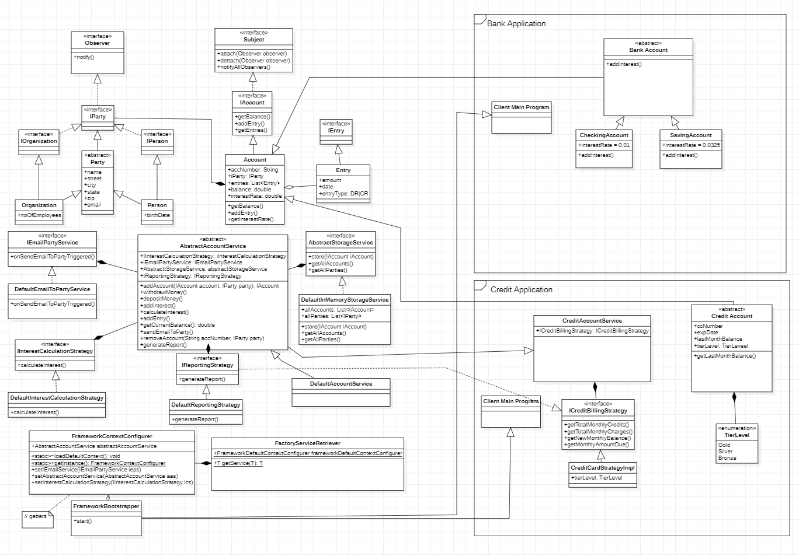

###  Framework: FINCO

# Introduction
A simple FINCO framework, with project.framework.support for party and account.

## Package Structure

1. FINCO
2. Bank
3. CCard

### 1. FINCO

```
├── project.framework.context
│   - FactoryServiceRetriever.java
│   - FrameworkBootstraper.java
│   ├── config
│       - FrameworkContextConfigurer.java
├── project.framework.support
    - Subject.java
    - Observer.java
├── project.framework.core
    ├── accountdetails
    |   ├── model
    |   |   ├── party
    |   |       - IParty.java
    |   |       - IPerson.java
    |   |       - IOrganization.java
    |   |       - Party.java
    |   |       - Organization.java
    |   |       - Person.java
    |   |   ├── account.java
    |   |       - IAccount.java
    |   |       - Account.java
    |   |       - IEntry.java
    |   |       - Entry.java
    |   - AbstractAccountService
    |   - IEmailPartyService
    |   - IInterestCalculationStrategy
    |   - IReportingStrategy
    |   ├── service
    |   |   - DefaultEmailToPartyService
    |   |   - DefaultInterestCalculationStrategy
    |   |   - DefaultReportingStrategy
    |   |   - DefaultAccountService
    ├── storage
    |   - AbstractStorageService
    |       ├── service
    |           - DefaultInMemoryStorageService
    ├── util
        - ...


```

## Structure
 - __"project.framework.context"__ provides a way to configure services and bootstrap client application.
 - __"project.framework.support"__ any generalized classes that adds incrementing functionality and acts as project.framework.support classes.
 - __"project.framework.core"__ contains all the project.framework.core functionalities
    - __"accountDetails"__ : contains models, and services for account related features
        - "model": IParty and IAccount
        - "service" default implementation for the abstractions
        - ... all abstractions of "accountDetails"
    - __"storage"__ : Extensible and default storage service 
    - __"util"__ any static utility methods or utility classes, that needs to be reused.


| <a target="_blank" href="#"></a> |
|----------------------------------------------------------------------------|
| FrameworkV3                                                                |

# Development

Note: Currently All Modules Under Development 

1. FINCO
2. Bank
3. CCard


### # Documentation

### # Running unit tests

### # Build

### # Running application:

