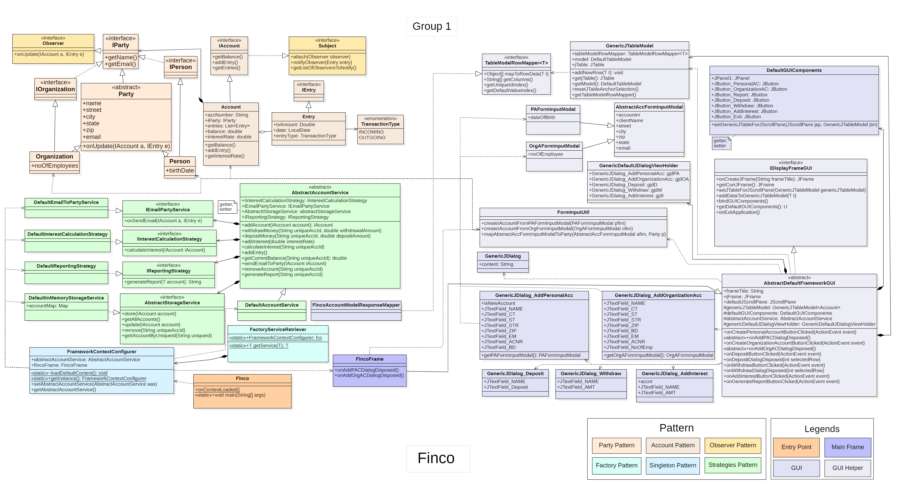
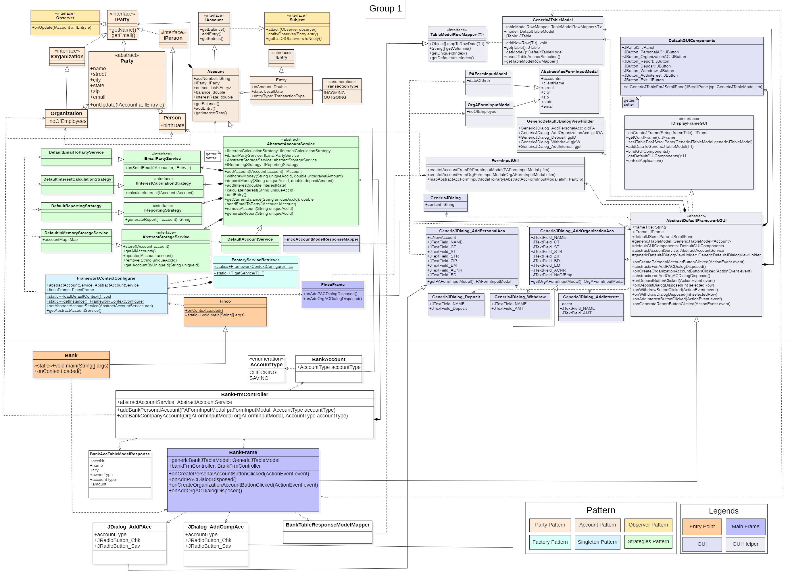
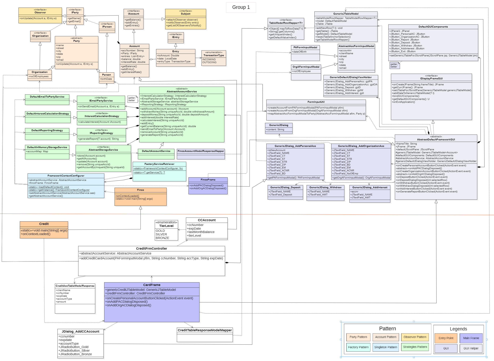

###  Framework: FINCO

All the submission documents, diagrams and sequence are in __"docs"__ folder.  
Repo maintained at: https://github.com/rust42/FINCO

# Introduction
A simple FINCO framework, default support and extensible functionality for party and account.


| <a target="_blank" href="#"></a> |
|--------------------------------------------------------------------|
| Framework                                                          |


| <a target="_blank" href="#"></a> |
|------------------------------------------------------------------|
| Bank with Framework                                              |


| <a target="_blank" href="#"></a> |
|--------------------------------------------------------------------|
| Credit with Framework                                              |


# Development
modules located in src/project directory

1. framework (main class: finco.java)
2. bank (main class: bank.java)
3. ccard (main class: credit.java)

- To generate metrics: run MetricsGenerator.java in __"src/scrips"__ directory  
- To build runnable artifacts: build individual manifest file under __"resources"__


### # Documentation
UML and sequence diagram available under docs folder, also included readme for sequence diagram.

### # Running application:
directory __"artifacts"__ contains jar. Double click or run with `java -jar finco.jar`


## Package Structure

### 1. framework

```
│   - Finco.java
├── project.framework.context
│   - FactoryServiceRetriever.java
│   - FrameworkContextConfigurer.java
├── project.framework.support
    - Subject.java
    - Observer.java
├── project.framework.core
    ├── accountdetails
    |   ├── model
    |   |   ├── party
    |   |       - IParty.java
    |   |       - IPerson.java
    |   |       - IOrganization.java
    |   |       - Party.java
    |   |       - Organization.java
    |   |       - Person.java
    |   |   ├── account.java
    |   |       - IAccount.java
    |   |       - Account.java
    |   |       - IEntry.java
    |   |       - Entry.java
    |   - AbstractAccountService
    |   - IEmailPartyService
    |   - IInterestCalculationStrategy
    |   - IReportingStrategy
    |   ├── service
    |   |   - DefaultEmailToPartyService
    |   |   - DefaultInterestCalculationStrategy
    |   |   - DefaultReportingStrategy
    |   |   - DefaultAccountService
    ├── storage
    |   - AbstractStorageService
    |       ├── service
    |           - DefaultInMemoryStorageService
    ├── util
├── project.framework.gui
   ├── defaults
       |  - ... // defaults
    |  - AbstractDefaultFrameworkGUI
    |  - GenericJTableModel
    |  - TableModelRowMapper


```

## Structure
- __"project.framework.context"__ provides a way to configure services and bootstrap client application.
- __"project.framework.support"__ any generalized classes that adds incrementing functionality and acts as project.framework.support classes.
- __"project.framework.core"__ contains all the project.framework.core functionalities
   - __"accountDetails"__ : contains models, and services for account related features
      - "model": IParty and IAccount
      - "service" default implementation for the abstractions
      - ... all abstractions of "accountDetails"
   - __"storage"__ : Extensible and default storage service
   - __"util"__ any static utility methods or utility classes, that needs to be reused.
-  __"project.framework.gui"__ contains all the gui helper and default classes
